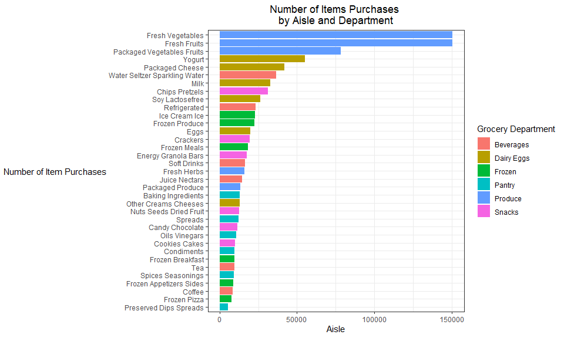

Homework 3 - Eric Connor
================
Eric Connor
2/14/2022

# Problem 1. Github repository

A Github repository is set up named pubh7462\_hw3\_conno400, and is
connected via an R Project. The repository is kept tidy with no
additional files or folders.

# Problem 2. Best Practices and Consistent Style

# Problem 3. Instacart

Import instacart dataset

``` r
instacart <- read.csv("data/instacart.csv")
```

## 3.1. Please create a gt summary table which describes the overall mean, median, and sd of the number of days since last order, number of items purchased, number of aisles, number of departments, order number, and percent of items reordered; for all customers orders in these data.

``` r
table_one <- instacart %>%
  group_by(order_id) %>%
  mutate(days = first(days_since_prior_order), # Create recodes for each of desired variables among order number
            items = last(add_to_cart_order),
            aisles = n_distinct(aisle),
            departments = n_distinct(department),
            order_num = first(order_number),
            reorder = sum(reordered) / n()) %>%
  ungroup() %>%
  select(order_id, days, items, aisles, departments, order_num, reorder) %>%
  unique() %>% # Keep only first instance of individual order
  pivot_longer(cols = c(days, items, aisles, departments, order_num, reorder), 
               names_to = "grocery_var", 
               values_to = "Value") %>% # Convert to long format
  rename(`Grocery Variable` = grocery_var) %>%
  mutate(`Grocery Variable` = factor(`Grocery Variable`) %>%
           fct_recode("Days" = "days", # Rename variable and individual levels
                      "Aisles" = "aisles",
                      "Items" = "items",
                      "Departments" = "departments",
                      "Order Number" = "order_num",
                      "Reorder Customer" = "reorder")) %>%
  group_by(`Grocery Variable`) %>%
  summarise(Mean = mean(Value), # Summarise each of columns among Grocery Variable status
            Median = median(Value),
            SD = sd(Value)) %>%
  gt() %>% # Create GT table with these series of summary measurements
  tab_header("Mean, Median, and Standard Deviation of Grocery Store Measurements") %>%
  fmt_percent(columns = c("Mean", "Median", "SD"), # Format number to percentage
              rows = 6,
              decimals = 1) %>%
  fmt_number(columns = c("Mean", "Median", "SD"),
             rows = c(1,2,3,4,5),
             decimals = 2) %>%
  cols_align(align = c("center"), # Center Mean, Median, and SD values
             columns = c("Mean", "Median", "SD")) %>%
  cols_align(align = c("left"),
             columns = c("Grocery Variable")) %>%
  gtsave("Table1.png", path = "./Images") # Save table to relative path
```


The mean, median, and standard deviation are presented among each of the
grocery variables, including aisles, days, departments, items, order
times, and the percentage of reordered items from an individual customer
in the above table. The values range depending on the various grocery
variable.

## 3.2. Create a visualization in ggplot2 which displays the number of orders (of all products) per aisle, which aisles ordered in a meaningful way.

``` r
instacart %>%
  group_by(aisle) %>%
  summarise(N = n()) %>% # Summarise the amount of orders under each aisle
  mutate(aisle = str_to_title(aisle),
         aisle = factor(aisle),
         aisle = fct_reorder(aisle, N, .fun = identity)) %>% # Clean aisle names and reorder variable based on quantity
  ggplot(aes(x = aisle, y = N, fill = N)) + # Bar plot of the frequency of items in each aisle
  geom_col() +
  scale_fill_gradient(low = "green", high = "red") + # Change bar plot colors
  coord_flip() +
  theme_bw() +
  xlab("Aisle Name") +
  ylab("Number of Purchases") +
  ggtitle("Number of Item Purchases by \nGrocery Store Aisle") +
  theme(plot.title = element_text(hjust = 0.5),
        axis.title.y = element_text(vjust = 0.5, angle = 0),
        legend.position = "none")
```


The above plot shows the number of purchases of items in each of the
aisles at the Minnesota grocery stores. Overall, Fresh Vegetables and
Fresh Fruits tend to be two of the most popular items. Whereas, there
are various other items in other aisles that are not as common among
individuals purchasing from Minnesota stores on Instacart.

## 3.3. What are the top 6 aisles in the top 6 departments by items purchased? Create a ggplot2 visualization which displays this information, which departments and aisles ordered in a meaningful way.

``` r
top_6.insta <- instacart %>%
  pull(department) %>%
  fct_count() %>% # Create counts among each of departments in store
  arrange(desc(n)) %>%
  top_n(n = 6) %>% # Take top 6 departments
  mutate(department = factor(f)) %>%
  select(department, n) # Keep top 6 departments in dataset

instacart %>%
  filter(department %in% top_6.insta$department) %>% # Subset dataset based on top 6 departments from above
  mutate(department = str_to_title(department),
         aisle = str_to_title(aisle)) %>%
  group_by(department, aisle) %>%
  summarise(N = n()) %>% # Create counts among each of aisles within top 6 departments
  arrange(desc(N), .by_group = TRUE) %>%
  slice(1:6) %>% # Take top 6 aisles
  ungroup() %>%
  arrange(desc(N)) %>%
  mutate(aisle = fct_reorder(factor(aisle), N, .desc = FALSE),
         department = factor(department)) %>% # Order top to bottom frequency of aisles in each department
  # Create plot for number of items purchased by aisle and department in order of aisles, color coded by department
  ggplot(aes(x = aisle, y = N, fill = department)) +
  geom_col() +
  coord_flip() +
  theme_bw() + 
  ggtitle("Number of Items Purchases \nby Aisle and Department") +
  xlab("Number of Item Purchases") +
  ylab("Aisle") + 
  theme(plot.title = element_text(hjust = 0.5),
        axis.title.y = element_text(vjust = 0.5, angle = 0)) +
  scale_fill_discrete(name = "Grocery Department")
```



The above figure shows the top 6 aisles in the top 6 departments,
arranged by the amount of items sold. This visualization is informative
to display the aisle with the most products sold, and its accompanying
department it is sold in. Fresh Vegetables tend to be the top purchased
item on Instacart while other products are not as commonly bought but
are still a top 6 aisle in a top 6 department in the store.

## 3.4. What are the top 5 aisles by items purchased and what are the top 5 items purchased in each of those aisles? Please display your answer in a single gt table.

``` r
top_5.insta <- instacart %>%
  pull(aisle) %>%
  fct_count() %>% # Create counts among each of aisles in grocery store
  arrange(desc(n)) %>%
  top_n(n = 5) %>% # Take top 5 aisles
  mutate(aisle = factor(f)) # Convert to factor variable type

gt4 <- instacart %>%
  filter(aisle %in% top_5.insta$aisle) %>% # Subset dataset based on top 5 aisles from above
  mutate(aisle = str_to_title(aisle)) %>%
  group_by(aisle, product_name) %>%
  summarise(N = n()) %>% # Create counts among each of items within top 5 aisles
  arrange(desc(N), .by_group = TRUE) %>%
  slice(1:5) %>% # Take top 5 items
  ungroup() %>%
  arrange(desc(N)) %>% # Arrange from largest to fewest number of items
  mutate(aisle = factor(aisle)) %>%
  rename('Product Name' = product_name,
         'Number of Purchases' = N) %>% # Rename variables for GT table
  # Create table based on number of items within top 5 aisles
  gt(groupname_col = "aisle") %>% # Table creation with Aisle name as group
  tab_header("Top 5 Items in each Grocery Story Aisle") %>%
  data_color(columns = 'Number of Purchases', # Color code based on value
             colors = scales::col_numeric(
               palette = c("white", "blue"),
               domain = c(0, 20000)
             )) %>% 
  tab_footnote(footnote = "Purchases based off Instacart orders",
               locations = cells_column_labels(
                 columns = 'Number of Purchases'
               )) %>%
  tab_source_note(source_note = "Data available from Instacart") %>%
  gtsave("Table4.png", path = "./Images") # Save table to relative path
```


The above table shows the top 5 aisles for items purhcased, with the
accompanying top 5 items purchased in each of the aisles. Overall,
Bananas were the most popular purchase from any aisle from Instacart.
Fruits and packaged vegetable fruits were the two most common aisles
from purchases on Instacart. The amount of purchases varied widely, with
fresh vegetables being extremely common with 150609 purchases and fresh
fruits nearly matching this number with 150473 purchases, but other top
5 aisles ranged from 41699 to 78493 purchases.
